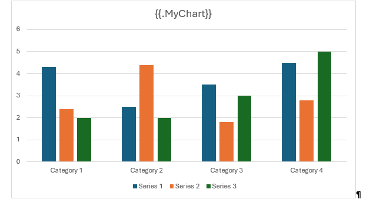

# DocxTemplater

_DocxTemplater is a library to generate docx documents from a docx template. The template can be **bound to multiple datasources** and be edited by non-programmers. It supports placeholder **replacement**, **loops**, and **images**._

[](https://www.nuget.org/packages/DocxTemplater/)
[](https://github.com/Amberg/DocxTemplater/blob/main/LICENSE)
[](https://github.com/Amberg/DocxTemplater/actions/workflows/ci.yml)

## Features
- Variable Replacement
- Collections - Bind to collections
- Conditional Blocks
- Images - Replace placeholder with Image data
- Chart Data Binding - Bind a chart to a data source
- Markdown Support - Converts Markdown to OpenXML
- HTML Snippets - Replace placeholder with HTML Content
- Dynamic Tables - Columns are defined by the datasource

## Quickstart

Create a docx template with placeholder syntax:
```
This Text: {{ds.Title}} - will be replaced
```

Open the template, add a model, and store the result to a file:
```csharp
var template = DocxTemplate.Open("template.docx");
// To open the file from a stream use the constructor directly 
// var template = new DocxTemplate(stream);
template.BindModel("ds", new { Title = "Some Text" });
template.Save("generated.docx");
```

The generated word document will contain:
```
This Text: Some Text - will be replaced
```

### Install DocxTemplater via NuGet

To include DocxTemplater in your project, you can [install it directly from NuGet](https://www.nuget.org/packages/DocxTemplater).

Run the following command in the Package Manager Console:
```
PM> Install-Package DocxTemplater
```

#### Additional Extension Packages

Enhance DocxTemplater with these optional extension packages:

| Package      | Description                             
|--------------|-----------------------------------
| [DocxTemplater.Images ](https://www.nuget.org/packages/DocxTemplater.Images)  |Enables embedding images in generated Word documents|
| [DocxTemplater.Markdown ](https://www.nuget.org/packages/DocxTemplater.Markdown)  | Allows use of Markdown syntax for generating parts of Word documents|

## Placeholder Syntax

A placeholder can consist of three parts: `{{property:formatter(arguments)}}`

- **property**: The path to the property in the datasource objects.
- **formatter**: Formatter applied to convert the model value to OpenXML (e.g., `toupper`, `tolower`, `img` format).
- **arguments**: Formatter arguments - some formatters have arguments.

The syntax is case insensitive.

### Quick Reference Examples

| Syntax                                                   | Description                                                                                     |
| -------------------------------------------------------- | ----------------------------------------------------------------------------------------------- |
| `{{SomeVar}}`                                            | Simple Variable replacement.                                                                    |
| `{?{someVar > 5}}...{{:}}...{{/}}`                       | Conditional blocks.                                                                             |
| `{{#Items}}...{{Items.Name}} ... {{/Items}}`             | Text block bound to collection of complex items.                                                |
| `{{#Items}}...{{.Name}} ... {{/Items}}`                  | Same as above with dot notation - implicit iterator.                                            |
| `{{#Items}}...{{.}:toUpper} ... {{/Items}}`              | A list of string all upper case - dot notation.                                                 |
| `{{#Items}}{{.}}{{:s:}},{{/Items}}`                      | A list of strings comma separated - dot notation.                                               |
| `{{SomeString}:ToUpper()}`                               | Variable with formatter to upper.                                                               |
| `{{SomeDate}:Format('MM/dd/yyyy')}`                      | Date variable with formatting.                                                                  |
| `{?{!.IsHw && .Name.Contains('Item')}}...{{}}`           | Logical Expression with string operation. Careful; Word Replaces `'` with `‘` and `"` with `”`. |
| `{{SomeDate}:F('MM/dd/yyyy')}`                           | Date variable with formatting - short syntax.                                                   |
| `{{SomeBytes}:img()}`                                    | Image Formatter for image data.                                                                 |
| `{{SomeHtmlString}:html()}`                              | Inserts HTML string into the word document.                                                     |
| `{{#Items}}{?{Items._Idx % 2 == 0}}{{.}}{{/}}{{/Items}}` | Renders every second item in a list.                                                            |
| `{{:ignore}} ... {{/:ignore}}`                           | Ignore DocxTemplater syntax, which is helpful around a Table of Contents.                       |
| `{{:break}}`                                             | Insert a line break after this keyword block.                                                   |
| `{{:PageBreak}}`                                         | Start a new page after this keyword block.                                                      |
| `{{:SectionBreak}}`                                      | Start a new "Section Break" on the next page after this keyword block.                          |
---
### Collections

To repeat document content for each item in a collection, use the loop syntax:
**{{#\<collection\>}}** ... content ... ****

All document content between the start and end tag is rendered for each element in the collection:
```
{{#Items}} This text {{Items.Name}} is rendered for each element in the items collection {{/Items}}
```

This can be used, for example, to bind a collection to a table. In this case, the start and end tag have to be placed in the row of the table:
| Name         | Position  |
|--------------|-----------|
| **{{#Items}}** {{Items.Name}} | {{Items.Position}} **{{/Items}}** |

This template bound to a model:
```csharp
var template = DocxTemplate.Open("template.docx");
var model = new
{
    Items = new[]
    {
        new { Name = "John", Position = "Developer" },
        new { Name = "Alice", Position = "CEO" }
    }
};
template.BindModel("ds", model);
template.Save("generated.docx");
```

Will render a table row for each item in the collection:
| Name  | Position  |
|-------|-----------|
| John  | Developer |
| Alice | CEO       |

#### Shortcut for Dot Notation - accessing the current item

To access the current item in the collection, use the dot notation `{{.}}`:
```
{{#Items}} This text {{.Name}} is rendered for each element in the items collection {{/Items}}
```

To access the outer item in a nested collection, use the dot notation `{{..}}` This is useful when you have nested collections and want to access a property from the outer scope:
```
{{#Items}} This text {{..SomePropertyFromTheOuterScope}} is rendered for each element in the items collection {{/Items}}
```

#### Accessing the Index of the Current Item

To access the index of the current item, use the special variable `Items._Idx` In this example, the collection is called "Items".

---
### Separator

To render a separator between the items in the collection, use the separator syntax:
```
{{#Items}} This text {{.Name}} is rendered for each element in the items collection {{:s:}} This is rendered between each element {{/Items}}
```

---
### Chart Data binding

Charts can be fully styled within the template, and a data source can then be bound to each chart.
To bind a chart to a data source, the chart’s title in the template must match the property name in the model. `MyChart`


To bind the chart correctly, the corresponding model property must be of th `ChartData` type.

*Currently, only bar charts are supported.*

```
            using var fileStream = File.OpenRead("MyTemplate.docx");
            var docTemplate = new DocxTemplate(fileStream);
            var model = new
            {
                MyChart = new ChartData()
                {
                    ChartTitle = "Foo 2",
                    Categories = ["Cat1", "Cat2", "Cat3", "Cat4", "Cat5"],
                    Series =
                    [
                        new() {Name = "serie 1", Values = [2200.0, 5500.0, 4600.25, 9560.56],},
                        new() {Name = "serie 2", Values = [1200.0, 2500.0, 8600.25, 4560.56],},
                    ]
                }
            };

            docTemplate.BindModel("ds", model);
            var resultStream = docTemplate.Process();
```

---
### Conditional Blocks

Show or hide a given section depending on a condition:
**{?{\<condition\>}}** ... content ... **{{/}}**

All document content between the start and end tag is rendered only if the condition is met:
```
{?{Item.Value >= 0}}Only visible if value is >= 0
{{:}}Otherwise this text is shown{{/}}
```
---
## Formatters

If no formatter is specified, the model value is converted into a text with `ToString`.

This is not sufficient for all data types. That is why there are formatters that convert text or binary data into the desired representation.

The formatter name is always case insensitive.

### String Formatters

- `ToUpper`
- `ToLower`

### FormatPatterns

Any type that implements `IFormattable` can be formatted with the standard format strings for this type.

See:
- [Standard date and time format strings](https://learn.microsoft.com/en-us/dotnet/standard/base-types/standard-date-and-time-format-strings)
- [Standard numeric format strings](https://learn.microsoft.com/en-us/dotnet/standard/base-types/standard-numeric-format-strings)

Examples:
```
{{SomeDate}:format(d)}  ----> "6/15/2009"  (en-US)
{{SomeDouble}:format(f2)}  ----> "1234.42"  (en-US)
```
---
### Image Formatter

**_NOTE:_** For the Image formatter, the NuGet package `DocxTemplater.Images` is required.

Because the image formatter is not standard, it must be added:
```csharp
var docTemplate = new DocxTemplate(fileStream);
docTemplate.RegisterFormatter(new ImageFormatter());
```

The Image Formatter replaces a placeholder with an image stored as a byte array.

The placeholder can be positioned in a `TextBox`, allowing end-users to adjust the image size easily within the template. The image will then automatically resize to match the dimensions of the `TextBox`.

#### Stretching Behavior

You can configure the image's stretching behavior as follows:

| Argument     | Example                           | Description                                               |
|--------------|-----------------------------------|-----------------------------------------------------------|
| `KEEPRATIO`  | `{{imgData}:img(keepratio)}`      | Scales the image to fit the container while preserving the aspect ratio |
| `STRETCHW`   | `{{imgData}:img(STRETCHW)}`       | Scales the image to fit the container’s width              |
| `STRETCHH`   | `{{imgData}:img(STRETCHH)}`       | Scales the image to fit the container’s height             |

If the image is not placed in a container, scaling can be applied using the `w` (width) or `h` (height) arguments. The `r` (rotate) argument can be used to rotate the image.

- When only `w` or `h` is specified, the image scales to the specified width or height, maintaining its aspect ratio.
- The size of the image can be specified in various units: cm, mm, in, px.


| Argument | Example                            | Description                                                                          |
|----------|------------------------------------|--------------------------------------------------------------------------------------|
| `w`      | `{{imgData}:img(w:100mm)}`         | Scales the image to a width of 100 mm, preserving aspect ratio                        |
| `h`      | `{{imgData}:img(h:100in)}`         | Scales the image to a height of 100 inches, preserving aspect ratio                   |
| `r`      | `{{imgData}:img(r:90)}`            | Rotates the image by 90 degrees                                                      |
| `w,h`    | `{{imgData}:img(w:50px,h:20px)}`   | Stretches the image to 50 x 20 pixels without preserving the aspect ratio             |

---
### Markdown Formatter

The Markdown Formatter in DocxTemplater allows you to convert Markdown text into OpenXML elements, which can be included in your Word documents. This feature supports placeholder replacement within Markdown text and can handle various Markdown elements including tables, lists, and more.

**_NOTE:_** For the Markdown formatter, the NuGet package `DocxTemplater.Markdown` is required.

Because the markdown formatter is not standard, it must be added:
```csharp
var docTemplate = new DocxTemplate(fileStream);
docTemplate.RegisterFormatter(new MarkDownFormatter());
```


#### Usage

To use the Markdown formatter, you need to specify the `md` prefix and pass in the Markdown text as a string. Here is an example:

```csharp
// Initialize the template
var template = DocxTemplate.Open("template.docx");
var markdown = """
                | Header 1 | Header 2 |
                |----------|----------|
                | Row 1 Col 1 | Row 1 Col 2 |
                | Row 2 Col 1 | Row 2 Col 2 |
                """;
// Bind model with Markdown content
template.BindModel("ds", new { MarkdownContent = markdown });

// Save the generated document
template.Save("generated.docx");
```

In your template, you would have a placeholder like this:

```
{{ds.MarkdownContent:MD}}
```
---
### Whitespace Trimming Around Directives

To improve template readability without affecting the final output, line breaks before and after template directives (e.g., `{{#...}}, {{/}}, {{:}}`) can be automatically removed.
This behavior can be enabled via the ProcessSettings:
```csharp
var docTemplate = new DocxTemplate(memStream, new ProcessSettings()
{
    IgnoreLineBreaksAroundTags = true
});
var result = docTemplate.Process();
```
---
### Error Handling

If a placeholder is not found in the model, an exception is thrown. This can be configured with the `ProcessSettings`:
```csharp
var docTemplate = new DocxTemplate(memStream);
docTemplate.Settings.BindingErrorHandling = BindingErrorHandling.SkipBindingAndRemoveContent;
var result = docTemplate.Process();
```
---
### Culture

The culture used to format the model values can be configured with the `ProcessSettings`:
```csharp
var docTemplate = new DocxTemplate(memStream, new ProcessSettings()
{
    Culture = new CultureInfo("en-us")
});
var result = docTemplate.Process();
```

## Advanced Model Binding: `ITemplateModel` and `TemplateModelWithDisplayNames`

### `ITemplateModel` Interface

For advanced scenarios where a standard object or dictionary is not suitable for your data model, you can implement the `ITemplateModel` interface.
This allows you to control how properties are resolved for template binding.

```csharp
public interface ITemplateModel
{
    bool TryGetPropertyValue(string propertyName, out ValueWithMetadata value);
}
```

Implement this interface to provide custom property lookup logic.
This is useful for dynamic models, computed properties, or when you want to support custom property resolution strategies.

### `TemplateModelWithDisplayNames` Base Class

`TemplateModelWithDisplayNames` is an abstract base class that extends `ITemplateModel` and allows you to bind template placeholders to properties using either their property name or a `[DisplayName]` attribute.
This is especially useful when you want to use user-friendly or localized names in your templates.

```csharp
using DocxTemplater.Model;
using System.ComponentModel;

public class PersonModel : TemplateModelWithDisplayNames
{
    [DisplayName("Vorname")]
    public string FirstName { get; set; }

    [DisplayName("Nachname")]
    public string LastName { get; set; }
}
```

In your template, you can then use either `{{person.Vorname}}` or `{{person.FirstName}}` to access the property.

## Support This Project

If you find DocxTemplater useful, please consider supporting its development:

[](https://github.com/sponsors/Amberg)
[](https://www.buymeacoffee.com/amstutz)