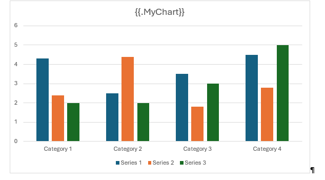

# DocxTemplater

_DocxTemplater is a library to generate docx documents from a docx template. The template can be **bound to multiple datasources** and be edited by non-programmers. It supports placeholder **replacement**, **loops**, and **images**._

[](https://www.nuget.org/packages/DocxTemplater/)
[](https://github.com/Amberg/DocxTemplater/blob/main/LICENSE)
[](https://github.com/Amberg/DocxTemplater/actions/workflows/ci.yml)

## Table of Contents

- [Features](#features)
- [Quickstart](#quickstart)
- [Placeholder Syntax](#placeholder-syntax)
  - [Quick Reference Examples](#quick-reference-examples)
  - [Collections](#collections)
  - [Range Loops](#range-loops)
  - [Chart Data binding](#chart-data-binding)
  - [Conditional Blocks](#conditional-blocks)
  - [Switch / Case Blocks](#switch--case-blocks)
  - [C# Expressions](#c-expressions)
- [Formatters](#formatters)
- [Image Formatter](#image-formatter)
- [Markdown Formatter](#markdown-formatter)
- [Sub-Template Formatter - Inserting Documents](#sub-template-formatter---inserting-documents)
- [Content Controls](#content-controls)
- [Whitespace Trimming Around Directives](#whitespace-trimming-around-directives)
- [Error Handling](#error-handling)
  - [Error Codes](#error-codes)
  - [Localized Error Messages](#localized-error-messages)
- [Culture](#culture)
- [Advanced Model Binding](#advanced-model-binding)
- [Template Schema Inspection](#template-schema-inspection)
- [Template Syntax Validation](#template-syntax-validation)
- [Support This Project](#support-this-project)

## Features
- Variable Replacement
- Collections - Bind to collections
- Conditional Blocks
- Images - Replace placeholder with Image data
- Chart Data Binding - Bind a chart to a data source
- Markdown Support - Converts Markdown to OpenXML
- HTML Snippets - Replace placeholder with HTML Content
- Dynamic Tables - Columns are defined by the datasource
- Content Controls - Fill Word content controls from the model, addressed by their tag
- Template Schema - Statically inspect which variables a template expects, without rendering
- Syntax Validation - Check a template for syntax errors without rendering it
- Localized Error Messages - Every error carries a code; messages are available in English, German, Swiss German, French and Italian and can be extended

## Quickstart

Create a docx template with placeholder syntax:
```
This Text: {{ds.Title}} - will be replaced
```

Open the template, add a model, and store the result to a file:
```csharp
var template = DocxTemplate.Open("template.docx");
// To open the file from a stream use the constructor directly 
// var template = new DocxTemplate(stream);
template.BindModel("ds", new { Title = "Some Text" });
template.Save("generated.docx");
```

The generated word document will contain:
```
This Text: Some Text - will be replaced
```

### Install DocxTemplater via NuGet

To include DocxTemplater in your project, you can [install it directly from NuGet](https://www.nuget.org/packages/DocxTemplater).

Run the following command in the Package Manager Console:
```
PM> Install-Package DocxTemplater
```

#### Additional Extension Packages

Enhance DocxTemplater with these optional extension packages:

| Package      | Description                             
|--------------|-----------------------------------
| [DocxTemplater.Images ](https://www.nuget.org/packages/DocxTemplater.Images)  |Enables embedding images in generated Word documents|
| [DocxTemplater.Markdown ](https://www.nuget.org/packages/DocxTemplater.Markdown)  | Allows use of Markdown syntax for generating parts of Word documents|
| [DocxTemplater.Localization.de ](https://www.nuget.org/packages/DocxTemplater.Localization.de)  | German error messages, see [Localized Error Messages](#localized-error-messages)|
| [DocxTemplater.Localization.de-CH ](https://www.nuget.org/packages/DocxTemplater.Localization.de-CH)  | Swiss German error messages (spelling without ß)|
| [DocxTemplater.Localization.fr ](https://www.nuget.org/packages/DocxTemplater.Localization.fr)  | French error messages|
| [DocxTemplater.Localization.it ](https://www.nuget.org/packages/DocxTemplater.Localization.it)  | Italian error messages|

Image metadata (size, format, EXIF rotation) is read by a dependency-free built-in reader that supports PNG, JPEG, GIF, BMP and TIFF.
If you need another image library for metadata detection, implement `IImageMetadataReader` and pass it to the formatter:

```csharp
using DocxTemplater.Images;

template.RegisterFormatter(new ImageFormatter(new MyImageMetadataReader()));
```

Migration note: the `DocxTemplater.Images.ImageSharp` package is discontinued. `ImageFormatter()` works without it. If you relied on ImageSharp for metadata detection, implement `IImageMetadataReader` with ImageSharp in your own project.

## Placeholder Syntax

A placeholder can consist of three parts: `{{property:formatter(arguments)}}`

- **property**: The path to the property in the datasource objects.
- **formatter**: Formatter applied to convert the model value to OpenXML (e.g., `toupper`, `tolower`, `img` format).
- **arguments**: Formatter arguments - some formatters have arguments.

The syntax is case insensitive. This includes property paths, the model prefixes passed to `BindModel` and the loop variables - `{{customerDetails.Name}}` resolves a model bound as `BindModel("CustomerDetails", ...)`.
Because prefixes are matched case-insensitively, two models whose prefixes differ only in casing cannot be bound at the same time.

### Quick Reference Examples

| Syntax                                                   | Description                                                                                     |
| -------------------------------------------------------- | ----------------------------------------------------------------------------------------------- |
| `{{SomeVar}}`                                            | Simple Variable replacement.                                                                    |
| `{?{someVar > 5}}...{{:}}...{{/}}`                       | Conditional blocks.                                                                             |
| `{{#Items}}...{{Items.Name}} ... {{/Items}}`             | Text block bound to collection of complex items.                                                |
| `{{#Items}}...{{.Name}} ... {{/Items}}`                  | Same as above with dot notation - implicit iterator.                                            |
| `{{#Items}}...{{.}:toUpper} ... {{/Items}}`              | A list of string all upper case - dot notation.                                                 |
| `{{#Items}}{{.}}{{:s:}},{{/Items}}`                      | A list of strings comma separated - dot notation.                                               |
| `{{SomeString}:ToUpper()}`                               | Variable with formatter to upper.                                                               |
| `{{SomeDate}:Format('MM/dd/yyyy')}`                      | Date variable with formatting.                                                                  |
| `{?{!.IsHw && .Name.Contains('Item')}}...{{}}`           | Logical Expression with string operation. Careful; Word Replaces `'` with `‘` and `"` with `”`. |
| `{{SomeDate}:F('MM/dd/yyyy')}`                           | Date variable with formatting - short syntax.                                                   |
| `{{(1 + 2)}}`                                            | Evaluate simple math expressions.                                                               |
| `{{(ds.Name.ToUpper() + "!")}}`                          | Expressions with variables and string operations.                                               |
| `{{(ds.Val?.ToString() ?? "N/A")}}`                      | Expressions with null-conditional and coalescing operators.                                     |
| `{{(ds.Price * 1.19)}:f(c)}`                             | Expressions with calculations and formatters.                                                   |
| `{{(ds.Items[0].Name)}}`                                 | Expressions with array / list / dictionary index access.                                        |
| `{{SomeBytes}:img()}`                                    | Image Formatter for image data.                                                                 |
| `{{SomeHtmlString}:html()}`                              | Inserts HTML string into the word document.                                                     |
| `{{ds}:template('ds.SubDocument')}`                      | Inserts another docx document (or OpenXML fragment) at the placeholder position.               |
| `{{@i:ItemCount}}...{{i}}...{{/}}`                       | Range loop that repeats its content `ItemCount` times.                                          |
| `{{@i:3}}...{{i}}...{{/}}`                               | Range loop with a fixed count; `i` takes the values 0, 1, 2.                                    |
| `{{#Items}}{?{Items._Idx % 2 == 0}}{{.}}{{/}}{{/Items}}` | Renders every second item in a list.                                                            |
| `{{#switch: SomeVar}}{{#case: 'A'}}...{{/}}{{#default}}...{{/}}{{/}}` | Evaluates switch cases and renders the matching block. there is a short syntax too                                          |
| `{{:ignore}} ... {{/:ignore}}`                           | Ignore DocxTemplater syntax, which is helpful around a Table of Contents.                       |
| `{{:break}}`                                             | Insert a line break after this keyword block.                                                   |
| `{{:PageBreak}}`                                         | Start a new page after this keyword block.                                                      |
| `{{:SectionBreak}}`                                      | Start a new "Section Break" on the next page after this keyword block.                          |
---
### Collections

To repeat document content for each item in a collection, use the loop syntax:
**{{#\<collection\>}}** ... content ... ****

All document content between the start and end tag is rendered for each element in the collection:
```
{{#Items}} This text {{Items.Name}} is rendered for each element in the items collection {{/Items}}
```

This can be used, for example, to bind a collection to a table. In this case, the start and end tag have to be placed in the row of the table:
| Name         | Position  |
|--------------|-----------|
| **{{#Items}}** {{Items.Name}} | {{Items.Position}} **{{/Items}}** |

This template bound to a model:
```csharp
var template = DocxTemplate.Open("template.docx");
var model = new
{
    Items = new[]
    {
        new { Name = "John", Position = "Developer" },
        new { Name = "Alice", Position = "CEO" }
    }
};
template.BindModel("ds", model);
template.Save("generated.docx");
```

Will render a table row for each item in the collection:
| Name  | Position  |
|-------|-----------|
| John  | Developer |
| Alice | CEO       |

#### Shortcut for Dot Notation - accessing the current item

To access the current item in the collection, use the dot notation `{{.}}`:
```
{{#Items}} This text {{.Name}} is rendered for each element in the items collection {{/Items}}
```

To access the outer item in a nested collection, use the dot notation `{{..}}` This is useful when you have nested collections and want to access a property from the outer scope:
```
{{#Items}} This text {{..SomePropertyFromTheOuterScope}} is rendered for each element in the items collection {{/Items}}
```

#### Accessing the Index of the Current Item

To access the index of the current item, use the special variable `Items._Idx` In this example, the collection is called "Items".

---
### Range Loops

To repeat document content a specific number of times based on an integer count or the length of a collection without directly iterating over it, use the range loop syntax:
**{{@i:count}}** ... content ... **{{/}}**

Here, `count` can be an integer literal (e.g. `{{@i:3}}`), a model property holding an integer, a string parseable to an integer, or an `IEnumerable` (in which case its count is used). The variable `i` is the zero-based index of the current iteration: `{{@i:3}}` renders its content three times with `i` set to `0`, `1` and `2`. If you omit the index variable name (e.g. `{{@count}}`), it defaults to `Index`.

---
### Separator

To render a separator between the items in the collection, use the separator syntax:
```
{{#Items}} This text {{.Name}} is rendered for each element in the items collection {{:s:}} This is rendered between each element {{/Items}}
```

---
### Chart Data binding

Charts can be fully styled within the template, and a data source can then be bound to each chart.
To bind a chart to a data source, the chart’s title in the template must match the property name in the model. `MyChart`


To bind the chart correctly, the corresponding model property must be of th `ChartData` type.

*Supported chart types: bar, 3-D bar, pie, 3-D pie and doughnut charts. Pie and 3-D pie show the first series only; doughnut charts show all series. Per-slice colors defined in the pie template are preserved; slices without a defined color are colored automatically.*

```
            using var fileStream = File.OpenRead("MyTemplate.docx");
            var docTemplate = new DocxTemplate(fileStream);
            var model = new
            {
                MyChart = new ChartData()
                {
                    ChartTitle = "Foo 2",
                    Categories = ["Cat1", "Cat2", "Cat3", "Cat4", "Cat5"],
                    Series =
                    [
                        new() {Name = "serie 1", Values = [2200.0, 5500.0, 4600.25, 9560.56],},
                        new() {Name = "serie 2", Values = [1200.0, 2500.0, 8600.25, 4560.56],},
                    ]
                }
            };

            docTemplate.BindModel("ds", model);
            var resultStream = docTemplate.Process();
```

---
### Conditional Blocks

Show or hide a given section depending on a condition:
**{?{\<condition\>}}** ... content ... **{{/}}**

All document content between the start and end tag is rendered only if the condition is met:
```
{?{Item.Value >= 0}}Only visible if value is >= 0
{{:}}Otherwise this text is shown{{/}}
```

---
### Switch / Case Blocks

Show or hide a given section depending on a switch variable:

| Long Syntax                                                | Short Syntax                                         |
| :--------------------------------------------------------- | :--------------------------------------------------- |
| `{{#switch: Item.Value}}`<br>&nbsp;&nbsp;`{{#case: 1}}Value is 1{{/}}`<br>&nbsp;&nbsp;`{{#case: 'A'}}Value is A{{/}}`<br>&nbsp;&nbsp;`{{#default}}Value is unknown{{/}}`<br>`{{/}}` | `{{#s: Item.Value}}`<br>&nbsp;&nbsp;`{{#c: 1}}Value is 1{{/}}`<br>&nbsp;&nbsp;`{{#c: 'A'}}Value is A{{/}}`<br>&nbsp;&nbsp;`{{#d}}Value is unknown{{/}}`<br>`{{/}}` |
| **Optional Closing Tags:** | A new Case or Default tag automatically closes any preceding open block. However, the switch itself must always be closed with `{{/}}`. |

> [!TIP]
> **Enums:**
> You can also use `.ToString()` to match `enum` properties against strings.
> For example, if `Item.Day` is `DayOfWeek.Monday`:
> `{{#s: Item.Day.ToString()}} ... {{#c: 'Monday'}} Match ... {{/}}`
---
### C# Expressions

You can evaluate C# expressions directly inside placeholders. This is useful for simple calculations, string manipulations, or handling null values. Expressions must be enclosed in parentheses: **{{(\<expression\>)}}**.

Expressions are evaluated using [DynamicExpresso](https://github.com/davideicardi/DynamicExpresso) and have access to all bound models.

#### Examples

- **Simple Math:** `{{(1 + 2)}}` -> `3`
- **String Concatenation:** `{{(ds.Name.ToUpper() + "!")}}` -> `WORLD!` (if Name is "world")
- **Null Handling:** `{{(ds.Val?.ToString() ?? "N/A")}}` -> `N/A` (if Val is null)
- **Complex Logic:** `{{(ds.Items.Count > 0 ? "Items available" : "Empty")}}`
- **Index Access:** `{{(ds.Items[0])}}` -> first element of a list, array or dictionary. Also works on method results, e.g. `{{(ds.Qa.Split('|')[0])}}`, and can be chained: `{{(ds.Items[1].Name)}}`.

> [!TIP]
> **Keep logic out of your templates.**
> Expressions are handy for small calculations, but complex logic embedded in a document is hard to read, hard to test, and easy to break (Word also likes to rewrite quotes and operators).
> For clean, maintainable templates prefer exposing a **property/getter with the logic on your model** and bind to that instead:
> ```csharp
> // Instead of {{(ds.Items[0].FirstName + " " + ds.Items[0].LastName)}}
> public string PrimaryContactName => Items.Count > 0
>     ? $"{Items[0].FirstName} {Items[0].LastName}"
>     : "n/a";
> ```
> Then the template stays simple: `{{ds.PrimaryContactName}}`. The logic lives in C#, where it can be unit-tested and reused.

#### Using Formatters with Expressions

Expressions also support the standard formatter syntax: **{{(\<expression\>)}:\<formatter\>(\<args\>)}**. This is especially useful when you calculate values that require specific formatting.

Example: `{{(ds.Price * 1.19)}:f(c)}` -> formats the calculated gross price as currency.

> [!IMPORTANT]
> **Security Note:**
> Expressions are evaluated in a restricted environment. Only bound models and basic .NET types are accessible. **Assignment operators are disabled** to ensure models cannot be modified from within the template. System namespaces, file system access, or other sensitive operations are not permitted. This prevents malicious code injection through templates.

---
## Formatters

If no formatter is specified, the model value is converted into a text with `ToString`.

This is not sufficient for all data types. That is why there are formatters that convert text or binary data into the desired representation.

The formatter name is always case insensitive.

### String Formatters

- `ToUpper`
- `ToLower`

### FormatPatterns

Any type that implements `IFormattable` can be formatted with the standard format strings for this type.

See:
- [Standard date and time format strings](https://learn.microsoft.com/en-us/dotnet/standard/base-types/standard-date-and-time-format-strings)
- [Standard numeric format strings](https://learn.microsoft.com/en-us/dotnet/standard/base-types/standard-numeric-format-strings)

Examples:
```
{{SomeDate}:format(d)}  ----> "6/15/2009"  (en-US)
{{SomeDouble}:format(f2)}  ----> "1234.42"  (en-US)
```
---
## Image Formatter

**_NOTE:_** For the Image formatter, the NuGet package `DocxTemplater.Images` is required.

Because the image formatter is not standard, it must be added:
```csharp
var docTemplate = new DocxTemplate(fileStream);
docTemplate.RegisterFormatter(new ImageFormatter());
```

The Image Formatter replaces a placeholder with an image stored as a byte array.

The placeholder can be positioned in a `TextBox`, allowing end-users to adjust the image size easily within the template. The image will then automatically resize to match the dimensions of the `TextBox`.

#### Stretching Behavior

You can configure the image's stretching behavior as follows:

| Argument     | Example                           | Description                                               |
|--------------|-----------------------------------|-----------------------------------------------------------|
| `KEEPRATIO`  | `{{imgData}:img(keepratio)}`      | Scales the image to fit the container while preserving the aspect ratio |
| `STRETCHW`   | `{{imgData}:img(STRETCHW)}`       | Scales the image to fit the container’s width              |
| `STRETCHH`   | `{{imgData}:img(STRETCHH)}`       | Scales the image to fit the container’s height             |

If the image is not placed in a container, scaling can be applied using the `w` (width) or `h` (height) arguments. The `r` (rotate) argument can be used to rotate the image.

- When only `w` or `h` is specified, the image scales to the specified width or height, maintaining its aspect ratio.
- The size of the image can be specified in various units: cm, mm, in, px.


| Argument | Example                            | Description                                                                          |
|----------|------------------------------------|--------------------------------------------------------------------------------------|
| `w`      | `{{imgData}:img(w:100mm)}`         | Scales the image to a width of 100 mm, preserving aspect ratio                        |
| `h`      | `{{imgData}:img(h:100in)}`         | Scales the image to a height of 100 inches, preserving aspect ratio                   |
| `r`      | `{{imgData}:img(r:90)}`            | Rotates the image by 90 degrees                                                      |
| `w,h`    | `{{imgData}:img(w:50px,h:20px)}`   | Stretches the image to 50 x 20 pixels without preserving the aspect ratio             |

---
## Markdown Formatter

The Markdown Formatter in DocxTemplater allows you to convert Markdown text into OpenXML elements, which can be included in your Word documents. This feature supports placeholder replacement within Markdown text and can handle various Markdown elements including tables, lists, and more.

**_NOTE:_** For the Markdown formatter, the NuGet package `DocxTemplater.Markdown` is required.

Because the markdown formatter is not standard, it must be added:
```csharp
var docTemplate = new DocxTemplate(fileStream);
docTemplate.RegisterFormatter(new MarkDownFormatter());
```


#### Usage

To use the Markdown formatter, you need to specify the `md` prefix and pass in the Markdown text as a string. Here is an example:

```csharp
// Initialize the template
var template = DocxTemplate.Open("template.docx");
var markdown = """
                | Header 1 | Header 2 |
                |----------|----------|
                | Row 1 Col 1 | Row 1 Col 2 |
                | Row 2 Col 1 | Row 2 Col 2 |
                """;
// Bind model with Markdown content
template.BindModel("ds", new { MarkdownContent = markdown });

// Save the generated document
template.Save("generated.docx");
```

In your template, you would have a placeholder like this:

```
{{ds.MarkdownContent}:MD}
```
---
## Sub-Template Formatter - Inserting Documents

The sub-template formatter `:template(...)` (short form `:T(...)`) replaces a placeholder with the content of another docx document or an OpenXML fragment. It is registered by default - no additional setup is required.

The first argument is the path to the model property that holds the template to insert. The following types are supported:

| Type                      | Description                                                                        |
|---------------------------|------------------------------------------------------------------------------------|
| `byte[]` / `Stream`       | A complete docx document - its body content is inserted at the placeholder position |
| `string`                  | An OpenXML fragment (paragraph, run or text)                                        |
| `OpenXmlCompositeElement` | An OpenXML element (paragraph, run, table row or table cell)                        |

```csharp
var template = DocxTemplate.Open("template.docx");
template.BindModel("ds", new
{
    Name = "John",
    SubDocument = File.ReadAllBytes("insert.docx") // byte[] or Stream
});
template.Save("generated.docx");
```

Placeholder in `template.docx`:
```
{{ds}:template('ds.SubDocument')}
```

The value in front of the formatter (here `ds`) is bound as `ds` *inside* the inserted document - so the inserted document can itself contain placeholders, which are resolved against that value. This also works inside loops, to render a sub-template once per item:

```
{{#ds.Items}}{{.}:T('ds.ItemTemplate')}{{/ds.Items}}
```

**_NOTE:_** The content is inserted by copying the OpenXML body elements into the host document. Styles, numbering definitions and images stored in the inserted document's own parts are not imported.

### Inserting sub-template as Inline Content

When working with small reusable sub-templates, it may be desirable to insert their content directly into the target paragraph instead of generating a new paragraph.

This behavior can be enabled through `ProcessSettings`:
```csharp
var docTemplate = new DocxTemplate(memStream, new ProcessSettings()
{
    InlineSubTemplates = true
});
var result = docTemplate.Process();
```

Inline insertion is particularly useful because it overcomes several limitations of the default sub-template insertion mode:

- Avoids layout discrepancies caused by additional paragraphs (for example, inconsistent table row heights).
- Allows sub-templates to be embedded seamlessly within existing text runs.
- Preserves paragraph-level formatting defined in the parent template (alignment, spacing, indentation, etc.), which is generally what Word users expect.

To prevent formatting inherited from the insertion point from overriding the sub-template's appearance, explicitly define the properties that should remain fixed within the sub-template. This allows the same sub-template to be reused in different contexts while still inheriting the surrounding document (cascading) style where appropriate.

**_NOTE:_** When using this mode, DOCX sub-templates consisting of a single paragraph are also merged inline.

---
## Content Controls

A Word [content control](https://support.microsoft.com/en-us/office/create-a-template-9bc66f57-cbd0-4a2c-be7c-9b839d3a9019) (a *structured document tag*, `w:sdt`) can be filled from the model by putting a placeholder in its **tag**. Set the control's *Tag* (Developer tab → Properties → Tag) to a placeholder such as `{{ds.Name}}`, and DocxTemplater replaces the control's content with the resolved value.

This is **opt-in** and off by default (existing templates may contain content-control tags never intended as placeholders). Enable it via `ProcessSettings.EnableContentControlTagBinding`:

```csharp
var template = DocxTemplate.Open("template.docx",
    new ProcessSettings { EnableContentControlTagBinding = true });
template.BindModel("ds", new { Name = "World", DeliveryDate = new DateTime(2026, 7, 8) });
template.Save("generated.docx");
```

| Content control *Tag*                | Result                                              |
| ------------------------------------ | --------------------------------------------------- |
| `{{ds.Name}}`                        | Filled with the value of `ds.Name`.                 |
| `{{ds.Name}:ToUpper()}`              | Formatters work exactly as in text placeholders.    |
| `{{ds.DeliveryDate}:F('d MMM yyyy')}`| Date/number format strings are supported.           |

The same model lookup and formatters as text placeholders are used, and content controls inside a loop are filled once per iteration (the tag resolves against the loop scope, e.g. `{{ds.Items}}` or `{{.Name}}`). A tag whose value resolves to `null` is treated like an unbound tag (see below).

> [!NOTE]
> Only formatters that produce **inline text** (e.g. `ToUpper`, `ToLower`, `format`, and C# expressions) are supported on a content control tag. Block-producing formatters (`html`, `md`, `img`, `template`) are not supported inside a content control - use them as normal text placeholders in the document body instead.

Unlike a text placeholder, a content control is a **named, persistent region**:

- The control and its tag are **never removed** and are **preserved** in the output, so the control stays addressable.
- A control whose tag **cannot be bound** is **left unchanged** (under `SkipBindingAndRemoveContent`). This makes multi-pass filling safe - a control filled in an earlier pass is never cleared by a later pass that does not bind its tag:

```csharp
// Pass 1: generate the document, binding what is known now.
var generated = Fill(templateBytes, new { Reference = "R-42" });

// Pass 2 (later): stamp a value into a control that was left empty in pass 1,
// without disturbing anything pass 1 already filled.
var finalDoc = Fill(generated, new { DeliveryDate = "8 Jul 2026" });
```

- The control's "showing placeholder" flag is cleared on a successful fill, so Word shows the value as real text rather than grey placeholder text.

A tag that is not a placeholder - or whose placeholder is a block directive such as `{{#items}}` - is ignored, so existing templates are unaffected. Placeholders in a content control's *content* (rather than its tag) keep working as normal text placeholders.

> [!NOTE]
> Content control tag bindings are not reported by `GetTemplateSchema()` (the tag is not part of the rendered text). This is the same limitation as sub-template formatters.

---
## Whitespace Trimming Around Directives

To improve template readability without affecting the final output, line breaks before and after template directives (e.g., `{{#...}}, {{/}}, {{:}}`) can be automatically removed.
This behavior can be enabled via the `ProcessSettings`:
```csharp
var docTemplate = new DocxTemplate(memStream, new ProcessSettings()
{
    IgnoreLineBreaksAroundTags = true
});
var result = docTemplate.Process();
```
---
## Error Handling

If a placeholder is not found in the model, an exception is thrown. This can be configured with the `ProcessSettings`:
```csharp
var docTemplate = new DocxTemplate(memStream);
docTemplate.Settings.BindingErrorHandling = BindingErrorHandling.SkipBindingAndRemoveContent;
var result = docTemplate.Process();
```

| `BindingErrorHandling`         | Behavior                                                                                                   |
|--------------------------------|------------------------------------------------------------------------------------------------------------|
| `ThrowException` (default)     | `Process()` throws an `OpenXmlTemplateException` for the first binding error.                             |
| `SkipBindingAndRemoveContent`  | Placeholders that cannot be bound are removed, loops and conditions with errors render nothing.           |
| `HighlightErrorsInDocument`    | Failed placeholders are highlighted in red and all error messages are listed at the top of the document.  |

### Error Codes

Every error raised by the template engine carries a `TemplateErrorCode` and the arguments of its message, so an application can react to it - or translate it - without parsing the message text:

```csharp
try
{
    template.Process();
}
catch (OpenXmlTemplateException e)
{
    // e.g. PlaceholderNotReplaced with Arguments[0] == "{{ds.Name}}"
    Console.WriteLine($"{e.ErrorCode}: {string.Join(", ", e.Arguments)}");
    // the cause, e.g. PropertyNotFoundOnType with Arguments[0] == "Name"
    var cause = e.InnerException as OpenXmlTemplateException;
}
```

`ErrorCode` is `TemplateErrorCode.None` for internal errors and for errors of third-party formatters that use the plain `OpenXmlTemplateException(string)` constructor. The documentation of each `TemplateErrorCode` value lists the meaning of its arguments.

### Localized Error Messages

Exception messages, `TemplateSyntaxError.Message` and the error list written with `HighlightErrorsInDocument` are formatted in the `ProcessSettings.UiCulture` - the culture of the **user who generates the document**. It defaults to `CultureInfo.CurrentUICulture` and is independent of `ProcessSettings.Culture`, which only formats the values in the document: a user with an English UI can generate a German invoice and still gets English error messages.

English is built in. Other languages are NuGet packages named `DocxTemplater.Localization.<language tag>`, the tag being the IETF language tag .NET uses as `CultureInfo.Name` (`de`, `de-CH`, `fr`, `it`, ...). Installing a package is all it takes: the first time a message is formatted for a culture, DocxTemplater looks for the assembly `DocxTemplater.Localization.<culture>` of that culture and its parents and loads the texts it finds (once per culture, the result is cached).

```csharp
// packages installed: DocxTemplater.Localization.de, DocxTemplater.Localization.fr
var template = new DocxTemplate(stream, new ProcessSettings
{
    Culture = new CultureInfo("de-CH"),   // number and date formats in the document
    UiCulture = new CultureInfo("fr-CH")  // language of the error messages: fr-CH -> fr
});
```

A culture without texts falls back to its parent culture (`de-CH` → `de`, `fr-CH` → `fr`) and finally to English, so every code always has a message. A specific culture takes precedence over its parent: with `DocxTemplater.Localization.de-CH` and `.de` installed, `de-CH` users get the Swiss spelling and `de-DE` / `de-AT` users the standard one.

Automatic loading uses reflection; in trimmed applications disable it with `TemplateErrorMessages.Default.AutoLoadLanguagePackages = false` and register the packs explicitly: `TemplateErrorMessages.Default.AddLanguage(new GermanErrorMessages())` (namespace `DocxTemplater.Localization`).

Your own language - or your own wording - is a dictionary from `TemplateErrorCode` to a format string. It does not have to be complete; missing codes fall back as described above. Adding a language twice merges the dictionaries, so single texts can be overridden. `TemplateErrorMessages.English` is the reference for the placeholders of each code:

```csharp
TemplateErrorMessages.Default.AddLanguage(new CultureInfo("es"), new Dictionary<TemplateErrorCode, string>
{
    [TemplateErrorCode.ModelNotFound] = "Modelo {0} no encontrado",
    [TemplateErrorCode.BlockNotClosed] = "'{0}' no está cerrado",
});
```

To ship a language as a package of its own, create an assembly named `DocxTemplater.Localization.<language tag>` with a public class implementing `ITemplateLanguagePack` (`Culture` + `Formats`) and a parameterless constructor; it is then loaded automatically like the built-in packages.

`TemplateErrorMessages.Default` is shared by all documents. To keep languages local to one document, assign a separate instance to `ProcessSettings.ErrorMessages`.

An error can be re-rendered in another language at any time, nested messages included: `e.GetMessage(new CultureInfo("de"))`, `syntaxError.GetMessage(culture)` and `syntaxError.ToString(culture)`.

---
## Culture

The culture used to format the model values can be configured with the `ProcessSettings`:
```csharp
var docTemplate = new DocxTemplate(memStream, new ProcessSettings()
{
    Culture = new CultureInfo("en-us")
});
var result = docTemplate.Process();
```

## Advanced Model Binding

Two ways to control how placeholders are resolved against your model: `ITemplateModel` and `TemplateModelWithDisplayNames`.

### `ITemplateModel` Interface

For advanced scenarios where a standard object or dictionary is not suitable for your data model, you can implement the `ITemplateModel` interface.
This allows you to control how properties are resolved for template binding.

```csharp
public interface ITemplateModel
{
    bool TryGetPropertyValue(string propertyName, out ValueWithMetadata value);
}
```

Implement this interface to provide custom property lookup logic.
This is useful for dynamic models, computed properties, or when you want to support custom property resolution strategies.

### `TemplateModelWithDisplayNames` Base Class

`TemplateModelWithDisplayNames` is an abstract base class that extends `ITemplateModel` and allows you to bind template placeholders to properties using either their property name or a `[DisplayName]` attribute.
This is especially useful when you want to use user-friendly or localized names in your templates.

```csharp
using DocxTemplater.Model;
using System.ComponentModel;

public class PersonModel : TemplateModelWithDisplayNames
{
    [DisplayName("Vorname")]
    public string FirstName { get; set; }

    [DisplayName("Nachname")]
    public string LastName { get; set; }
}
```

In your template, you can then use either `{{person.Vorname}}` or `{{person.FirstName}}` to access the property.

## Template Schema Inspection

`GetTemplateSchema()` statically analyzes a template **without rendering it** and returns the structural schema of the variables, collections, and nested objects the template references.
Use it to validate a caller's model against the template's expectations before rendering, or to generate a skeleton model for callers to fill in.

```csharp
using var template = DocxTemplate.Open("template.docx");

// Template: "Hello {{customer.Name}}" and "{{#items}}{{items.Price}}{{/items}}"
var schema = template.GetTemplateSchema();

// Roots are the top-level models you would pass to BindModel (case-insensitive)
foreach (var root in schema.Roots.Values)
{
    Console.WriteLine($"{root.Name}: {root.Kind}");
}

schema.Roots["customer"].Properties["Name"].Kind;          // Scalar
schema.Roots["items"].Kind;                                // Collection
schema.Roots["items"].ItemSchema.Properties["Price"].Kind; // Scalar
```

Each `TemplateSchemaNode` exposes:

| Member        | Description                                                                 |
|---------------|-----------------------------------------------------------------------------|
| `Name`        | Name as referenced in the template (case-insensitive against the model).    |
| `Kind`        | `Scalar`, `Object`, or `Collection`.                                        |
| `Properties`  | Child properties of an `Object` node (empty for scalars/collections).       |
| `ItemSchema`  | Element shape of a `Collection` node (`null` if items are never accessed).  |

The schema is the **union over all branches** (both `if` and `else`, every `case`, every loop body) - a caller must be prepared to bind anything the template could reach at runtime.

`GetTemplateSchema()` may be called before `Process()` on the same instance; the analysis result is cached and reused when rendering, so there is no need to reopen the template:

```csharp
using var template = DocxTemplate.Open("template.docx");
var schema = template.GetTemplateSchema();   // inspect
template.BindModel("customer", customer);
template.Save("generated.docx");             // render - reuses the cached analysis
```

**Known limitations** (these constructs may yield an incomplete schema):
- Sub-template formatters (`:template` / `:T`): the referenced sub-template is itself a runtime template string and not visible to static analysis.
- Dynamic tables (`:dyntable`): only the collection itself is reported, not its runtime-defined rows/columns.
- String-key indexing (`props["key"]`): the key is not statically known and is not reflected in the schema.

## Template Syntax Validation

`ValidateTemplateSyntax()` checks the template syntax **without rendering it and without a model** and returns all errors found (an empty list if the syntax is valid). The document is not modified.
The same parser runs at the start of `Process()`: errors with `Severity == Error` (broken block structure) make `Process()` throw an `OpenXmlTemplateException` listing all of them, while warnings (malformed tags, suspicious expressions) only show up here.

```csharp
using var template = DocxTemplate.Open("template.docx");
foreach (var error in template.ValidateTemplateSyntax())
{
    // e.g. "Body: '{{/Orders}}' does not match '{{#Items}}' (near '...')"
    Console.WriteLine(error);
}
```

Errors:
- Blocks that are not closed and closing tags without an opening tag.
- Else `{{:}}` outside of a condition or more than once, separator `{{:s:}}` outside of a collection loop, `{{#case}}`/`{{#default}}` outside of a switch, `{{#}}` / `{{#switch}}` without a name or expression, unknown inline keywords (`{{:Foo}}`).

Warnings:
- Closing tags that do not match their opening tag (`{{#Items}}...{{/Orders}}`, `{?{...}}...{{/Items}}`, `{{:ignore}}...{{/}}`) - rendering closes the current block anyway. The closing tag may omit the implicit model prefix (`{{#ds.Items}}...{{/Items}}`).
- Malformed tags that silently remain as text, e.g. `{{Name}`, `{{first name}}`, a stray `}}`.
- Unbalanced parentheses and unterminated strings in conditions, expressions, switch selectors and case values.

Everything between `{{:ignore}}` and `{{/:ignore}}` is treated as plain text and not validated.

Each `TemplateSyntaxError` exposes the `Severity`, the `Part` (`Body`, `Header` or `Footer`), the offending `Tag`, a `Message` and the surrounding text as `Context`. The `ErrorCode` and `Arguments` identify the error independent of the message language, see [Error Codes](#error-codes); the `Message` is formatted in the `ProcessSettings.UiCulture` and can be re-rendered in another language with `GetMessage(culture)`.
Binding errors (unknown variables, wrong types, unknown formatters) are not detected, as they depend on the model.

## Support This Project

If you find DocxTemplater useful, please consider supporting its development:

[](https://github.com/sponsors/Amberg)
[](https://www.buymeacoffee.com/amstutz)

